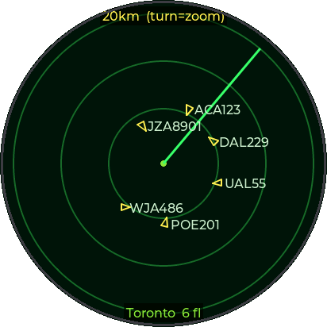
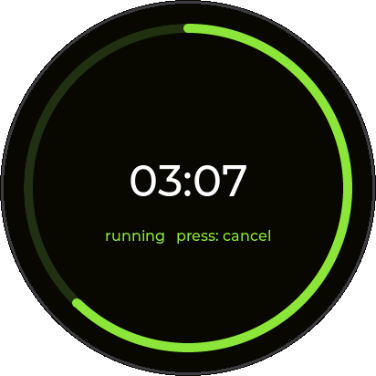
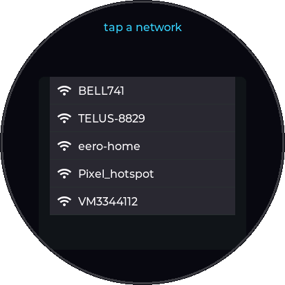

# WatcherOS

A small, extensible app framework for the **SenseCAP Watcher** (ESP32-S3 + round
412×412 touch LCD, rotary knob, mic/speaker, RGB LED, Himax AI camera, WiFi).
Built on ESP-IDF v5.2.1.

## Screenshots
Rendered from the actual LVGL UI code by the headless simulator in [`sim/`](sim/)
(no device photo — see [Simulator](#simulator)).

| Radar (home) | Timer | WiFi |
|:---:|:---:|:---:|
|  |  |  |

## Apps
- **Radar** *(home)* — live ATC-style flight radar. IP-geolocates the device, pulls nearby aircraft from the OpenSky Network, and plots each as a heading arrow (rotated by its true track) with callsign. Knob zooms the range (10/20/50/100/200 km); sweep + range rings; dims when data goes stale. Backlight sleeps after inactivity to save power.
- **Timer** — knob sets the countdown (±30 s), press starts/cancels; progress arc + centered MM:SS; alarm beeps and the LED flashes when it elapses (fires even from another screen).
- **WiFi** — scan nearby networks, pick one, enter the password, connect; credentials saved to NVS and auto-reconnect on boot. A **QR** button is wired for phone-QR provisioning (scan `WIFI:S:..;P:..;;` with the camera).

## Controls
- **Swipe / tap** the touchscreen → switch between apps (LVGL `tileview`).
- **Knob** → in-app adjustment only (e.g. timer duration).
- **Button (press)** → app action (start/select). **Long-press** → back to Home.

## Architecture (why it's stable)
- The **LVGL task owns all UI**. Periodic work runs in an `lv_timer` (inside the
  LVGL task) — never from an external loop grabbing the LVGL mutex. This avoids
  the render-loop deadlock that plagued earlier attempts.
- **Audio + LED live in `fx_task`** (fed by a queue / shared state) — never called
  from the UI path, so nothing blocking stalls rendering.
- **Input callbacks only set flags**; the `lv_timer` applies them. The knob is
  burst-gated (rejects electrical phantom counts).
- Add a function = write one `app_t { build, on_show, tick, on_knob, on_button }`
  and register it in `APPS[]`.

## The critical fix: LVGL draw buffer must be in INTERNAL RAM
The vendor `bsp_lvgl_init()` allocates the LVGL draw buffer in **PSRAM**. DMA-ing
that PSRAM buffer to the QSPI LCD **stalls the flush**, hanging the UI ~28 s in
(watchdog logs it; with panic off it just freezes). Fix — initialise with an
internal DMA buffer:

```c
bsp_display_cfg_t dcfg = {
    .lvgl_port_cfg = ESP_LVGL_PORT_INIT_CONFIG(),
    .buffer_size = 412 * 48,           /* partial buffers, fit internal RAM */
    .double_buffer = true,
    .flags = { .buff_dma = true, .buff_spiram = false },
};
lv_disp_t *disp = bsp_lvgl_init_with_cfg(&dcfg);   /* NOT bsp_lvgl_init() */
```

## Build & flash
```sh
. ~/esp/esp-idf/export.sh
idf.py set-target esp32s3
idf.py -p /dev/ttyACM1 -b 460800 flash    # ttyACM1 is the console+flash port
```
`main/idf_component.yml` references the SenseCAP Watcher BSP by absolute path
(`/home/im/lab/SenseCAP-Watcher-Firmware/components/sensecap-watcher`).

## Simulator
The screens above are rendered on a PC — no device or camera needed — by
compiling the app's LVGL drawing against the LVGL 8.4 source and dumping the
framebuffer to PNG. Handy for README shots and quick layout iteration.

```sh
cd sim
./build.sh        # gcc: links the LVGL sources + sim_main.c -> ./sim
./sim             # renders each screen to out_*.565 (raw RGB565)
python3 render.py # RGB565 -> round 412x412 PNGs in ../docs/
```
`sim/sim_main.c` reproduces each screen's exact LVGL calls (colors, radii,
fonts, blip geometry) with representative data; `render.py` applies the round
bezel mask.
